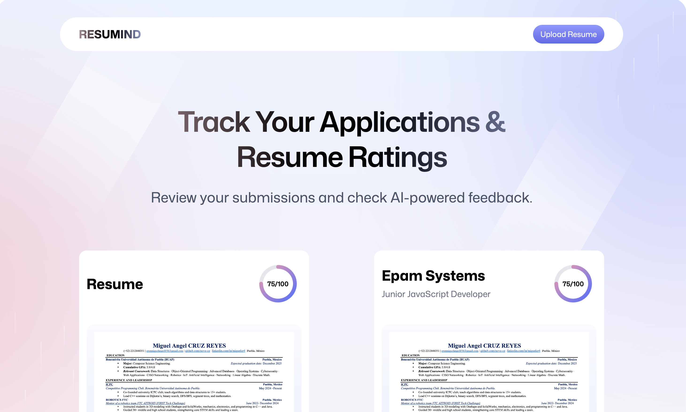

# 🚀 AI Resume Analyzer

<div align="center">

**Transform your job search with AI-powered resume analysis. Get instant feedback, ATS optimization tips, and personalized career advice to land your dream job.**

[](https://react.dev/)
[](https://www.typescriptlang.org/)
[](https://vitejs.dev/)
[](https://tailwindcss.com/)
[](https://www.anthropic.com/)

</div>

<div align="center">
  
</div>

## 🎯 Objective

AI Resume Analyzer is designed to help students and recent graduates create powerful, ATS-optimized resumes that significantly increase their chances of landing internships and job opportunities. Our mission is to bridge the gap between academic achievements and professional requirements by providing intelligent, personalized feedback that transforms ordinary resumes into compelling career assets.

## ✨ Features

- **AI-Powered Analysis**: Get instant feedback on your resume's content, layout, and impact
- **ATS Optimization**: Ensure your resume passes through Applicant Tracking Systems
- **Skill Gap Analysis**: Identify missing skills for your target job positions
- **Personalized Recommendations**: Receive tailored suggestions for improvement
- **Multi-Format Support**: Upload PDF, DOCX, or paste your resume text
- **Real-time Feedback**: See changes and improvements in real-time
- **Privacy-First**: Your data stays on your device - no resume storage on our servers

## 🛠️ Tech Stack

### Core Technologies
- **Frontend**: React 19 with TypeScript
- **Styling**: Tailwind CSS with custom animations
- **Build Tool**: Vite 4
- **State Management**: Zustand
- **Routing**: React Router v7
- **PDF Processing**: PDF.js
- **AI Integration**: Anthropic Claude API
- **Cloud Integration**: Puter.js for seamless cloud storage and file management

### Development Tools
- **Package Manager**: npm
- **Linting & Formatting**: ESLint + Prettier
- **Version Control**: Git
- **Responsive Design**: Mobile-first approach

## 🚀 Getting Started

### Prerequisites

- Node.js 18+
- npm 9+
- An Anthropic API key (for AI features)

### Installation

1. **Clone the repository**
   ```bash
   git clone https://github.com/yourusername/ai-resume-analyzer.git
   cd ai-resume-analyzer
   ```

2. **Install dependencies**
   ```bash
   npm install
   ```

3. **Set up environment variables**
   Create a `.env` file in the root directory and add your Anthropic API key:
   ```
   VITE_ANTHROPIC_API_KEY=your_api_key_here
   ```

4. **Start the development server**
   ```bash
   npm run dev
   ```

5. **Open in your browser**
   The app will be available at `http://localhost:5173`

## 🤖 How It Works

1. **Upload Your Resume**: Drag and drop your PDF or DOCX file, or paste your resume text
2. **AI Analysis**: Our system processes your resume using advanced NLP and machine learning
3. **Get Insights**: Receive detailed feedback on:
   - ATS compatibility
   - Keyword optimization
   - Content structure
   - Skills assessment
   - Actionable improvement tips

## 📊 Features in Detail

### 1. ATS Compatibility Check
- Identifies if your resume is ATS-friendly
- Highlights potential issues that might cause rejection
- Suggests improvements for better parsing

### 2. Content Analysis
- Evaluates resume sections (summary, experience, education, skills)
- Checks for proper formatting and structure
- Identifies missing information

### 3. AI-Powered Suggestions
- Personalized recommendations based on your target job
- Actionable tips to improve your resume's impact
- Real-time feedback as you make changes

## 🌟 Why Choose AI Resume Analyzer?

- **Save Time**: Get instant feedback instead of waiting for human reviews
- **Data-Driven**: Make informed decisions based on AI analysis
- **Always Improving**: Our AI continuously learns from the latest hiring trends
- **Privacy Focused**: Your resume never leaves your browser
- **Free & Open Source**: No hidden costs or subscriptions

## 📚 Resources

- [How to Write an ATS-Friendly Resume](https://example.com/ats-guide)
- [Resume Writing Best Practices](https://example.com/resume-tips)
- [Common Resume Mistakes to Avoid](https://example.com/resume-mistakes)

## 🤝 Contributing

Contributions are welcome! Please read our [Contributing Guidelines](CONTRIBUTING.md) for details on how to contribute to this project.

## 📄 License

This project is licensed under the MIT License - see the [LICENSE](LICENSE) file for details.

## 🙏 Acknowledgments

- Built with ❤️ using modern web technologies
- Powered by Anthropic's Claude AI
- Inspired by the challenges of modern job searching

---

<div align="center">
  Made with ❤️ by Your Name | 🌐 [yourwebsite.com](https://yourwebsite.com)
</div>

```bash
docker build -t my-app .

# Run the container
docker run -p 3000:3000 my-app
```

The containerized application can be deployed to any platform that supports Docker, including:

- AWS ECS
- Google Cloud Run
- Azure Container Apps
- Digital Ocean App Platform
- Fly.io
- Railway

### DIY Deployment

If you're familiar with deploying Node applications, the built-in app server is production-ready.

Make sure to deploy the output of `npm run build`

```
├── package.json
├── package-lock.json (or pnpm-lock.yaml, or bun.lockb)
├── build/
│   ├── client/    # Static assets
│   └── server/    # Server-side code
```

## Styling

This template comes with [Tailwind CSS](https://tailwindcss.com/) already configured for a simple default starting experience. You can use whatever CSS framework you prefer.

---

Built with ❤️ using React Router.
